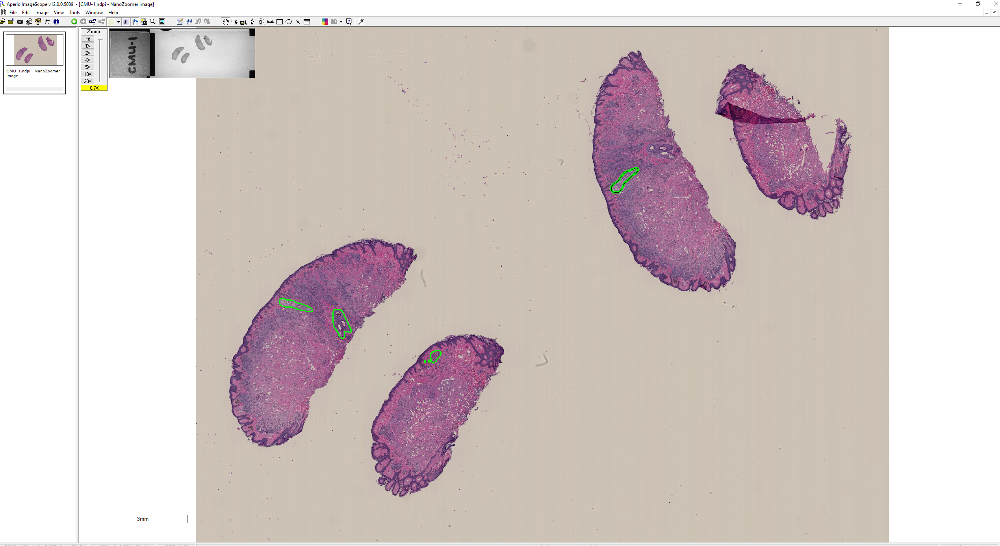

# Understanding Data preparation from Whole slide images (WSI)

In this section we will summarize how we parse the freehand annotations drawn on WSI to train the CIS detection models.

Imagescope is a generic open source tool, available for performing annotation on WSI images.

It is important to know how to extract the regions and the vertices that form these free-hand annotations. Once we are comfortable
extracting them we could export to any co-ordinate system and custom-built packages.

For demo purpose, I have used a CMU-1.ndpi downloaded from the following web link (http://openslide.cs.cmu.edu/download/openslide-testdata/Hamamatsu/)
 
Note: In general WSI images are high in memory. Corresponding Authors of the publication can be contacted to see if the WSI can be made available if they are not part of any sensitive clinical trial information.
 

1. Visualization

  
  

 
                            
Square raw directory contains the whole slide images and the respective annotations.
Square annotation directory contains 
    1. positive example saved in Mat_files/pos directory
    2. negative example saved in Mat_files
    3. Gt.im is the original cws patch and GT.Mask contains the manual segmentation mask.
	

Summary
1. Read whole slide image (Image format supported by imagescope and openslide library is used here for the purpose of explaination).
2. Extract the free hand vertices.
3. Save the binary mask for processing.
4. Annotation supporting two whole slide image formats are provided here.

# Visualisation of randomly sampled images with free hand annotations on tiled images  

  
  
  
  

