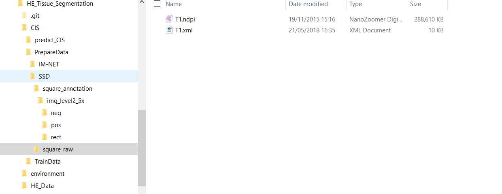

# Understanding data preparation for object detection models 

In this section we will summarize the organization of directory struture to enable the end user extract the information needed to directly train the object detection models.

1. parseCIS

  
  

  
  

 
                            
Square raw directory contains the whole slide images and the respective annotations.
Square annotation directory contains 
    1. positive example 
    2. negative example 
    3.rectangle annotations overlayed on the image for visualisation.

# Visualisation of the square annotations as regions of individual tiles from the whole slide images

  

