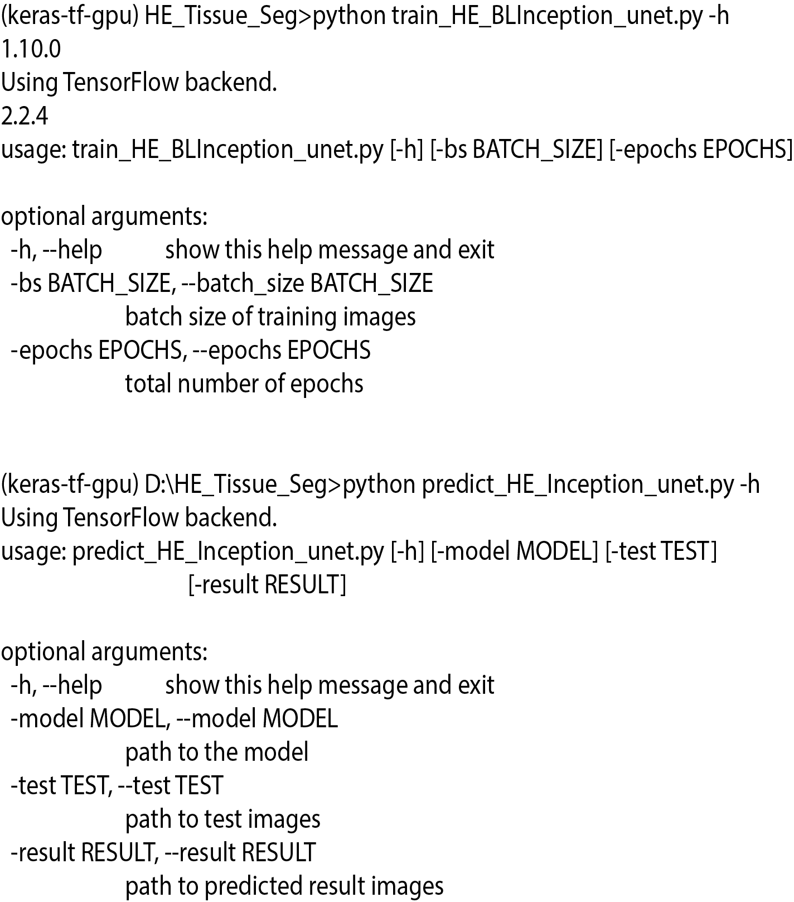

# UNMaSk: Unmasking the immune microecology of ductal carcinoma in situ with deep learning.

# Parameters of train and predict for tissue segmentation pipeline

  
  
 

# Citation

# Reference

All training data of carcinoma in situ regions that were annotated as a part of the project is made available in this github repository.
Training data tiles were anonymised from raw HE image tiles. Request for data access for the Duke samples can be submitted to E.S.H and Y.Y

# Training
Data preparation and implementation codes are maintained in this repository and will be periodically updated. Please contact the corresponding authours for future colloborations and any queries regarding the implementation.

