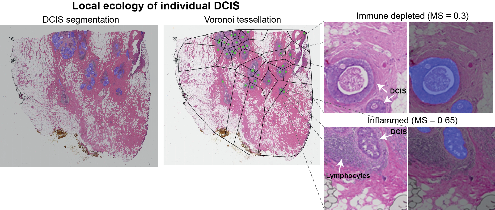
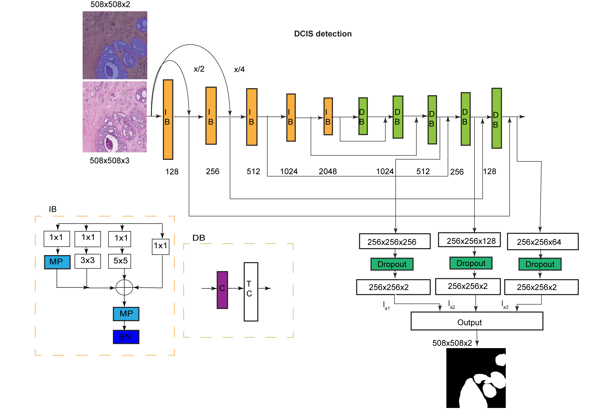
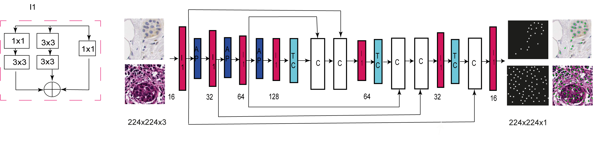

# UNMaSk: Unmasking the immune microecology of ductal carcinoma in situ with deep learning.

UNMaSk pipeline consists of processing pipelines for segmentation of ductal carcinoma in situ (DCIS) regions from whole slide images. The primary steps are broken down into four modules and are as given below.

### UNMaSk DCIS segmentation module tree
 * [HE_tissue_segmentation](./HE_tissue_seg)

 * [DCIS segmentation](./DCIS)
 
 * [HE_cell_classification](./HE_cell_classification/predict)
 
 * [HE_cell_detection](./IHC_Cell_Detection)
    

Modular arrangement help in navigation to each module and supports both tile level and tissue level processing. Each of these pipelines are organised inside individual directory and you will be able to find detailed explanation in the respective sub-directories. Wherever possible docker images and command line instructions are specified to make it user friendly for off the shelf users.

## UNMaSk pipeline overview and architecture 

  
   <figcaption> Overview schematic of UNMaSk pipeline for DCIS segmentation UNet architecture for tissue segmentation and one
   of the existing deep learning methods, single-shot detector (SSD) architecture, used for DCIS detection.
 

 
 

 
<figcaption> Spatial Voronoi tessellation to examine local tissue ecology for each DCIS duct, based on deep learning results on DCIS segmentation and single-cell classification. Examples shown are immune depleted and immune predominant/inflamed ecology local to individual DCIS ducts from the DCIS immune colocalisation/Morisita Score (MS) spatial analysis. </figcaption>
 

 

  
   
   <figcaption> Schematic of IM-Net architecture for DCIS segmentation.       
      </figcaption>
 

 
 

    
   
   
Center this text DRDIN!

   <figcaption> Schematic of DRDIN cell detection network 
       </figcaption>
 
 

  

### Training data and annotations used in DCIS segmentation

a. Images used for training
https://github.com/pathdata/HE_Tissue_Segmentation/tree/master/DCIS/TrainData (Left)

b. Ground truth images
https://github.com/pathdata/HE_Tissue_Segmentation/tree/master/DCIS/TrainData/mask (Middle)

c. Overlay of groundtruth on the training image
https://github.com/pathdata/HE_Tissue_Segmentation/tree/master/DCIS/TrainData/overlay (Right)

### Illustrative training images for DCIS segmentation based on IM-NET

<figure>
    
    
</figure>
<figure>
     
    
</figure>
<figure>
    
    
 </figure>

## Citation

https://doi.org/10.1038/s41523-020-00205-5

## Reference

All training data of carcinoma in situ regions that were annotated as a part of the project is made available in this github repository.
Training data tiles were anonymised from raw HE image tiles. Request for data access for the Duke samples can be submitted to E.S.H and Y.Y

### Notes

1. This project is a work in progress and contact the corresponding authors for any queries. Docker images are packaged in each of these modules are made available and few example test images are provided for users to start their experiment. All the modules are independant of each other so each module can be iteratively tested. Usage of tiled images will help to test the pipeline without performing tissue segmentation.

