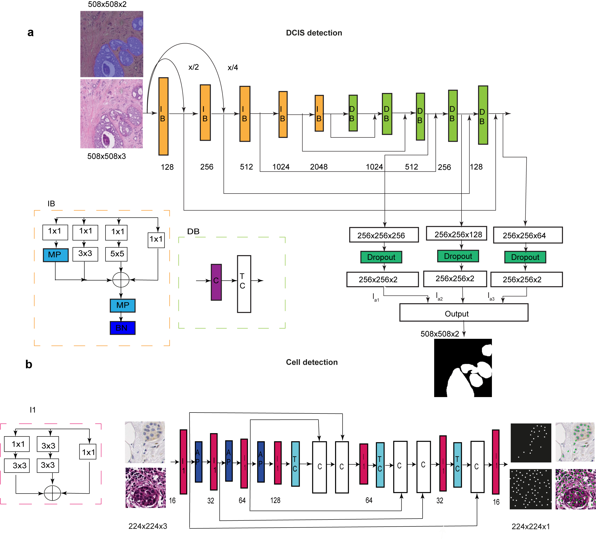

# UNMaSk: Unmasking the immune microecology of ductal carcinoma in situ with deep learning.

UNMaSk pipeline consists of processing pipelines for both HE and IHC images. The primary steps consists of four modules as given below.
1. Tissue Segmentation (HE_tissue_seg)
2. Cell Detection      (Cell_Detection)
3. Cell Classification (HE_cell_classification)
4. Ductal carcinoma in situ Segmentation (organised in CIS)

Each of these pipelines are organised inside individual directory and you will be able to find detailed explanation in the respective sub-directories. Wherever possible docker images and command line instructions are specified to make it user friendly for off the shelf users.

# UNMaSk pipeline overview and architecture 

  
   <figcaption> Figure 1. Overview schematic of UNMaSk pipeline for DCIS segmentation a. UNet architecture for tissue segmentation and one
of the existing deep learning methods, single-shot detector (SSD) architecture, used for DCIS detection. b. Spatial Voronoi tessellation to
examine local tissue ecology for each DCIS duct, based on deep learning results on DCIS segmentation and single-cell classification. Examples
shown are immune depleted and immune predominant/inflamed ecology local to individual DCIS ducts from the DCIS immune
colocalisation/Morisita Score (MS) spatial analysis. </figcaption>
 

 

 

 

  
   
   <figcaption> Figure 2. a. Schematic of IM-Net architecture for DCIS segmentation b. Schematic of DRDIN cell detection network. </figcaption>
  

  

# Training Data

Images used for training
https://github.com/pathdata/HE_Tissue_Segmentation/tree/master/CIS/TrainData

Ground truth images
https://github.com/pathdata/HE_Tissue_Segmentation/tree/master/CIS/TrainData/mask

Overlay of groundtruth on the training image
https://github.com/pathdata/HE_Tissue_Segmentation/tree/master/CIS/TrainData/overlay

# Illustrative images used in training IM-NET

<figure>
    
    <figcaption> Input Image </figcaption>
</figure>
<figure>
     
    <figcaption> Ground truth image </figcaption>
</figure>
<figure>
    
    <figcaption> Overlay image </figcaption>
 </figure>

# Citation

# Reference

All training data of carcinoma in situ regions that were annotated as a part of the project is made available in this github repository.
Training data tiles were anonymised from raw HE image tiles. Request for data access for the Duke samples can be submitted to E.S.H and Y.Y

# Training
Data preparation and implementation codes are maintained in this repository and will be periodically updated. Please contact the corresponding authours for future collaboration and any queries regarding the implementation.

Note: This project is a work in progress and contact the corresponding authors for any queries

